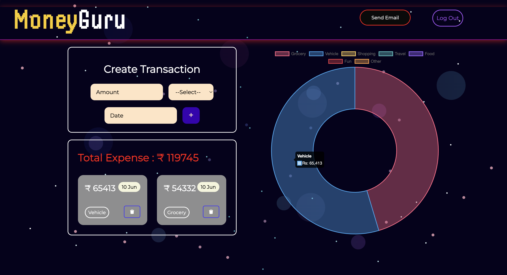

# MoneyGuru 💰

MoneyGuru is a full-stack Expense Tracker application built with the MERN stack (MongoDB, Express, React, Node.js). It allows users to securely track, manage, and visualize their expenses, helping them take better control of their finances.

## 🚀 Features

- User authentication with **JWT**
- Register and log in to access personal dashboards
- Add, view, and delete expenses
- RESTful API for user and transaction management
- Clean, responsive user interface

## 🛠️ Tech Stack

- **Frontend**: React, CSS, Axios
- **Backend**: Node.js, Express.js
- **Database**: MongoDB
- **Authentication**: JSON Web Tokens (JWT), bcrypt
- **API**: RESTful API architecture

## 📦 Installation

### Prerequisites
- Node.js and npm
- MongoDB (local or Atlas)

### Clone the repository

```bash
git clone https://github.com/Sahiil-Chhillar/MoneyGuru.git
cd MoneyGuru
```
### Backend setup
```bash
cd Backend
npm install
npm run dev
```
### Frontend setup
```bash
cd frontend
npm install
npm start
```

- The frontend will typically run on http://localhost:3000
- The backend will typically run on http://localhost:5000

### Environment Variables
- Create a .env file in the /server directory with:
```bash
  MONGO_URI=your_mongo_connection_string
  JWT_SECRET=your_jwt_secret_key
```

## 📸 Screenshots
### Home Page


### Login Page


### SignUp Page


## 🤝 Contributing
- Contributions are welcome! Feel free to open issues or pull requests.
